<div align="center">


# OllaBridge ⚡️

**Bring your own LLMs, devices, GPUs, and provider accounts.
Use them securely from anywhere through one OpenAI-compatible API.**

[](https://badge.fury.io/py/ollabridge)
[](https://www.python.org/downloads/)
[](https://opensource.org/licenses/MIT)
[](https://github.com/psf/black)

[Quick Start](#-60-second-start) • [The Dashboard](#%EF%B8%8F-the-dashboard) • [Why OllaBridge](#-why-teams-choose-ollabridge) • [Local vs Cloud vs Enterprise](#-local-vs-cloud-vs-enterprise) • [Docs](#-documentation)

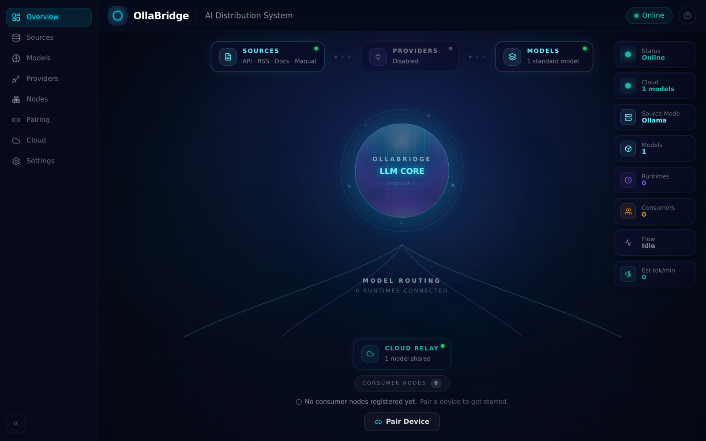

*The OllaBridge control tower: your models, devices, providers, and cloud relay — live, in one place.*

</div>

---

## 🎯 What is OllaBridge?

> **One gateway. All your LLMs. Everywhere.**

OllaBridge turns your PC into a **private, OpenAI-compatible LLM provider in ~60 seconds** — and grows with you into a hybrid control plane for every model you can reach: local Ollama, remote GPUs, your team's workstations, and your own OpenAI/Anthropic/Gemini accounts.

**The problem:** your models live everywhere (laptop, cloud GPU, gaming PC, hosted APIs), and every app needs a different endpoint, key, and config.

**The OllaBridge answer:** apps connect to **one URL with one key**. OllaBridge routes each request to the right compute — and can always tell you exactly where it went.

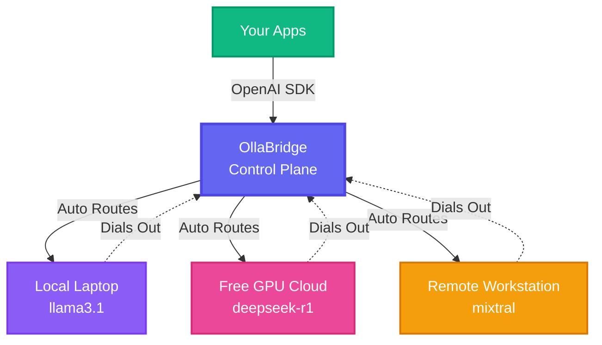
```mermaid
graph TB
    A[Your Apps] -->|OpenAI SDK| B[OllaBridge<br/>Control Plane]

    B -->|Auto Routes| C[Local Laptop<br/>llama3.1]
    B -->|Auto Routes| D[Free GPU Cloud<br/>deepseek-r1]
    B -->|Auto Routes| E[Remote Workstation<br/>mixtral]

    C -.->|Dials Out| B
    D -.->|Dials Out| B
    E -.->|Dials Out| B

    style B fill:#6366f1,stroke:#4f46e5,stroke-width:3px,color:#fff
    style A fill:#10b981,stroke:#059669,stroke-width:2px,color:#fff
    style C fill:#8b5cf6,stroke:#7c3aed,stroke-width:2px,color:#fff
    style D fill:#ec4899,stroke:#db2777,stroke-width:2px,color:#fff
    style E fill:#f59e0b,stroke:#d97706,stroke-width:2px,color:#fff
```

**Key innovation:** compute nodes **dial out** to your gateway over outbound WebSockets. No port forwarding, no VPN, no config hell — your gaming PC at home can serve your laptop at a coffee shop.

---

## ⚡ 60-Second Start

```bash
pip install ollabridge
ollabridge start
```

That's it — Ollama is installed if needed, a model is pulled, an API key is generated, and your OpenAI-compatible endpoint is live at `http://localhost:11435/v1`.

Building from source? Two commands give you the full product, backend **and** dashboard:

```bash
make install      # backend + frontend into .venv (never touches system Python)
make run          # gateway + dashboard at http://localhost:11435/ui
```

Then point any OpenAI SDK at it:

```python
from openai import OpenAI

client = OpenAI(
    base_url="http://localhost:11435/v1",
    api_key="sk-ollabridge-...",   # printed at startup
)

print(client.chat.completions.create(
    model="llama3.1",
    messages=[{"role": "user", "content": "Hello!"}],
).choices[0].message.content)
```

Works out of the box with the OpenAI SDK, LangChain, Node.js, cURL — anything that speaks the OpenAI API. More in **[docs/EXAMPLES.md](docs/EXAMPLES.md)**.

---

## 🖥️ The Dashboard

A real-time command center for your entire LLM infrastructure — models, sources, devices, and the cloud relay, all visualized live at **`http://localhost:11435/ui`**.

### 🎛️ Share exactly what you choose — per model

Every model gets its own independent switches: **This PC · Cloud · per-app allow-lists · Routing**. Nothing leaves your machine until you flip a switch, and the *Published to OllaBridge Cloud* panel always shows precisely what your paired apps can see — no surprises, no hidden catalog.

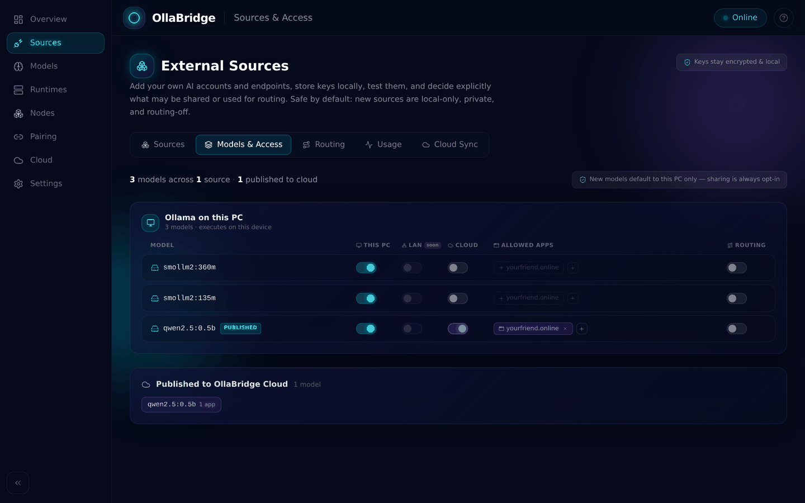

<div align="center">

*One model published to the cloud and scoped to a single app — the others stay private to this PC. Safe by default, opt-in by design.*

</div>

### 🔌 Every AI account in one hub

Connect **OpenAI, Anthropic, Google Gemini, IBM watsonx.ai, Azure OpenAI, AWS Bedrock, Groq, Mistral** and more — 14 providers plus any OpenAI-compatible endpoint — with one uniform **add → test → rotate → remove** flow. Keys are encrypted at rest, stored on *your* machine, and never echoed back. New sources start local-only, private, and routing-off.

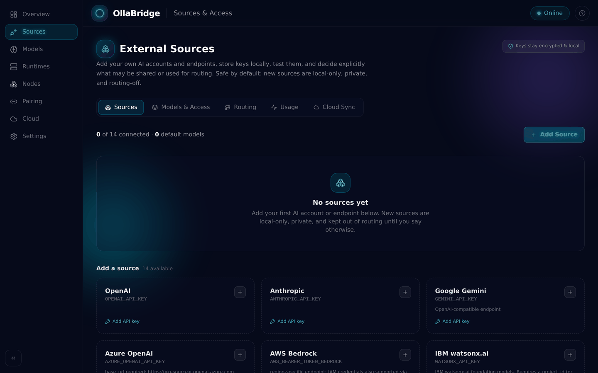

<div align="center">

*Sources are peers, not modes — local Ollama and enterprise APIs side by side, each with its own keys, models, and sharing scope.*

</div>

### ☁️ Pair once, reach your models anywhere

| Cloud Relay | Device Pairing |
|---|---|
| 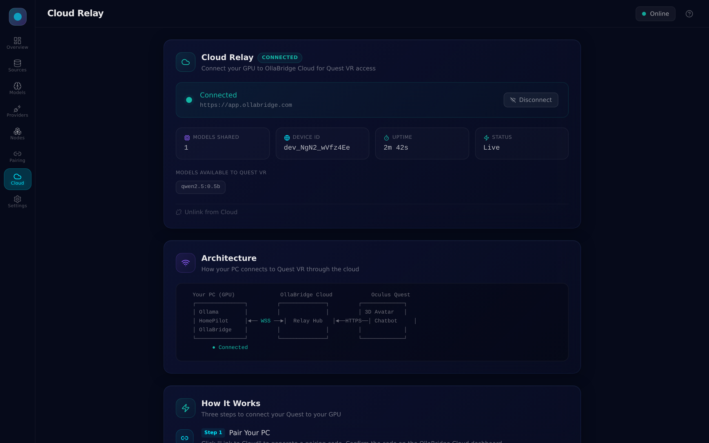 | 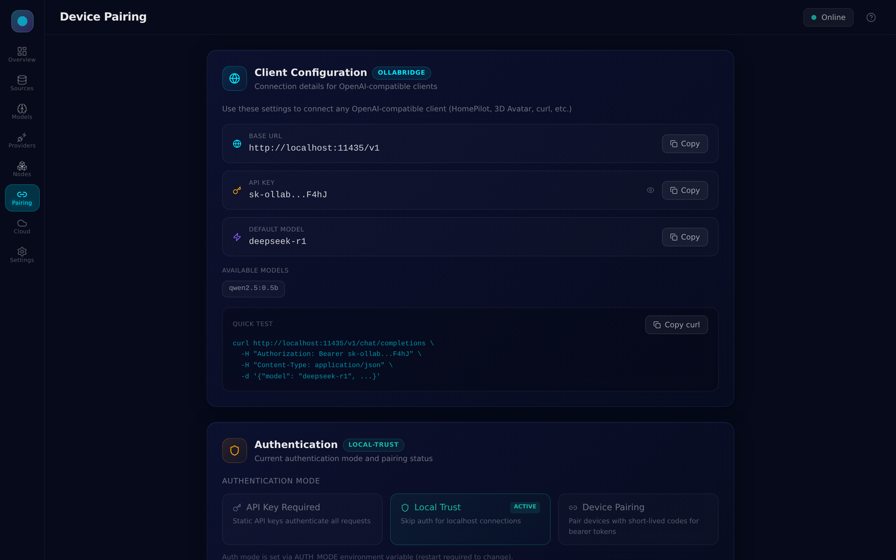 |

| Model Inventory | Local Runtimes |
|---|---|
| 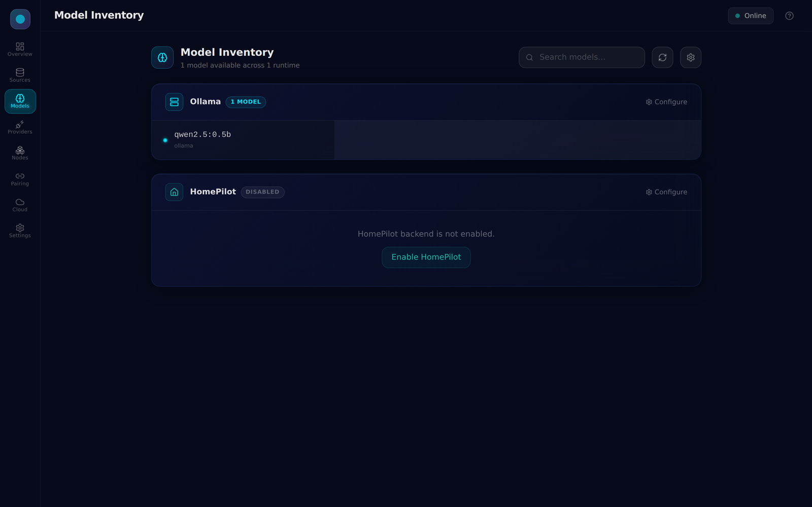 | 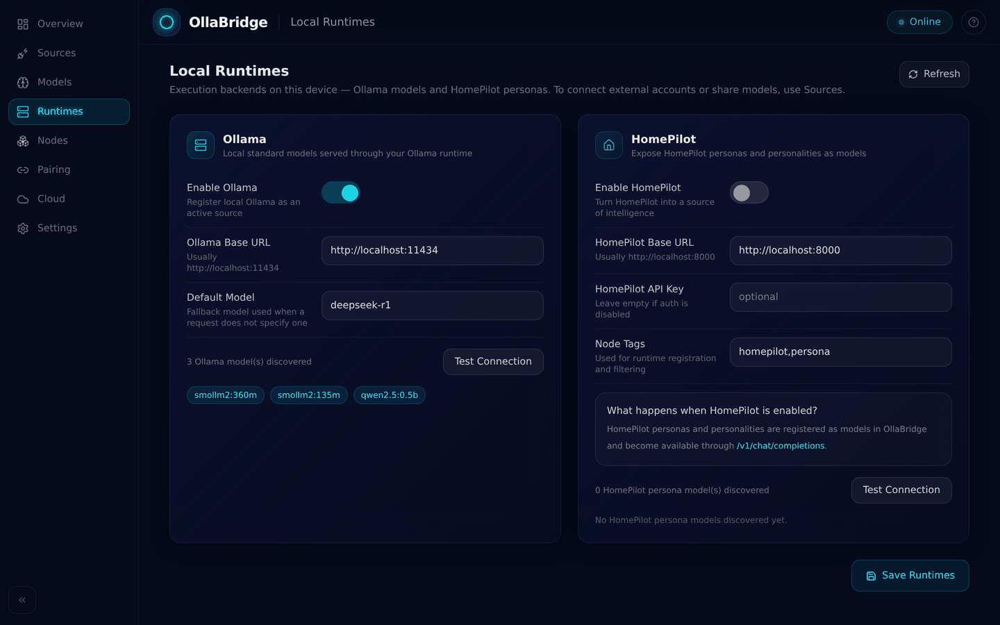 |

<details>
<summary>More screens: Providers Hub, Settings &amp; classic Sources</summary>

| Providers Hub | Settings |
|---|---|
| 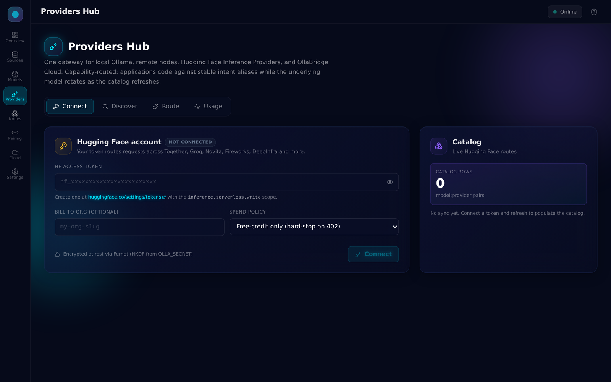 | 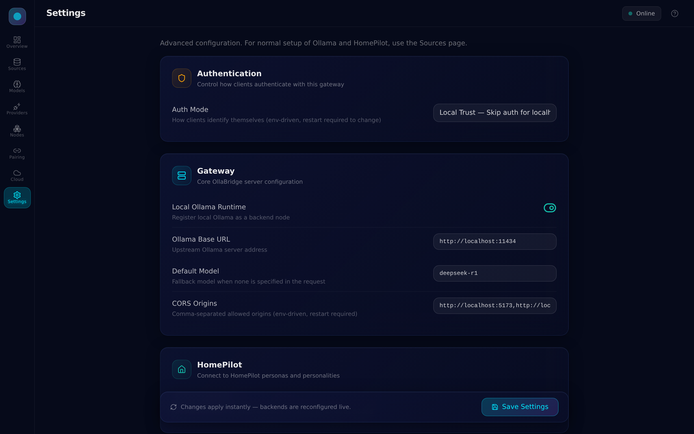 |

| Sources (classic) | |
|---|---|
| 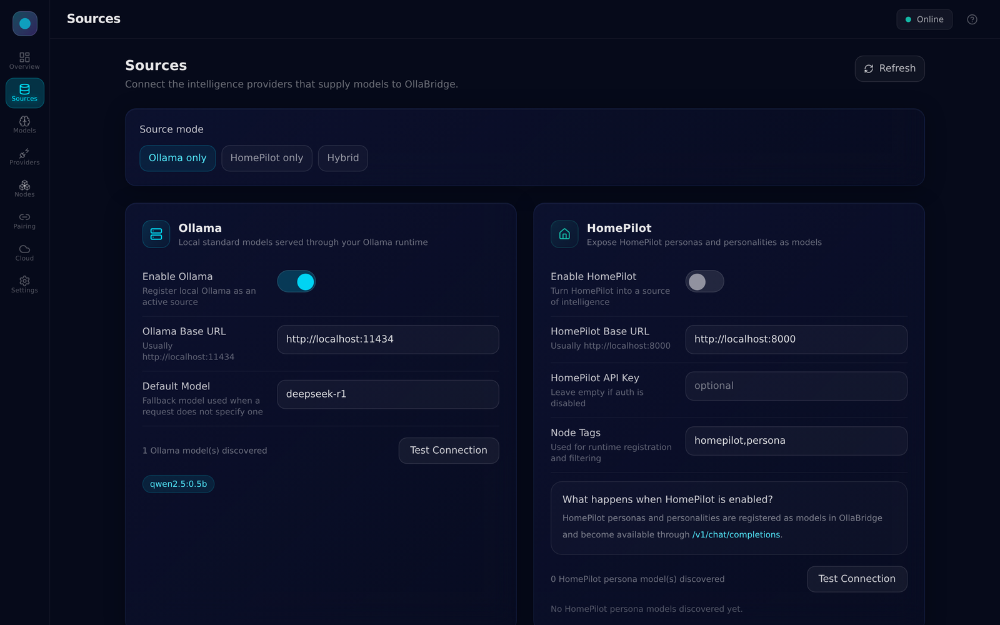 | |

</details>

```bash
# Install frontend dependencies
make ui-install

# Development (hot-reload, proxied to OllaBridge API)
make ui-dev

# Production build (served at /ui when gateway is running)
make ui-build
```

Once built, the dashboard is served at **`http://localhost:11435/ui`** whenever the gateway runs. React 19 + TypeScript + Vite, TanStack Query live polling, Framer Motion animation.

<p align="center">
  
</p>

---

## 🚀 Why Teams Choose OllaBridge

| | |
|---|---|
| 🔒 **Local-first by default** | No cloud login, no telemetry, no prompt logging. Prompts, responses, and keys stay on your machine unless *you* decide otherwise. |
| 🎛️ **Per-model sharing controls** | Decide model by model what's visible where — this PC, the cloud, a specific app. Publishing is explicit, scoped, and always inspectable. |
| 🎯 **One source of truth** | Every app, every device, one OpenAI-compatible URL. Models can move between machines — your code never changes. |
| 🌍 **Any GPU, anywhere** | Nodes dial out — add a gaming PC, a Colab notebook, or a fleet of cloud GPUs in one command each. See [docs/SCALING.md](docs/SCALING.md). |
| 🔑 **Secure BYOK provider hub** | Bring your own OpenAI, Anthropic, Gemini, Groq, Bedrock, Mistral keys and more — encrypted at rest, redacted everywhere, routed across your authorized devices and workspaces. See [docs/PROVIDER_KEYS.md](docs/PROVIDER_KEYS.md). |
| ☁️ **Optional cloud relay** | `ollabridge login` pairs your device with OllaBridge Cloud so your models are reachable from anywhere — metadata-only sync, verifiable end to end. |
| 🧭 **Enterprise-grade trust** | `ollabridge doctor` verifies every link in the chain. Request tracing, policy routing, RBAC interfaces, audit posture — built in, documented, tested. See [docs/ENTERPRISE.md](docs/ENTERPRISE.md). |

---

## 🧭 Local vs Cloud vs Enterprise

OllaBridge is **local-first**. Cloud is optional. Enterprise builds on both.

| Mode | What runs | What leaves your machine | How to enable |
|---|---|---|---|
| **Local** (default) | OpenAI-compatible gateway on `localhost:11435` | Nothing. No cloud login, no telemetry, no prompt logging. | `ollabridge start` |
| **Cloud** (optional) | Local gateway + outbound relay to OllaBridge Cloud | Metadata only by default: device status, model names, routing profiles, health metrics. Never prompts, responses, or provider keys. | `ollabridge login` |
| **Enterprise** | Cloud orgs, fleet enrollment, shared policies | Same metadata rules, org-scoped; bootstrap tokens for fleet provisioning | See [docs/ENTERPRISE.md](docs/ENTERPRISE.md) |

```bash
ollabridge start          # local only — no cloud required
ollabridge login          # optional: pair with OllaBridge Cloud
ollabridge sync status    # see exactly what syncs (and what never does)
ollabridge sync disable   # turn all cloud sync off
ollabridge logout         # unpair and delete credentials
```

**The privacy contract** ([docs/PRIVACY.md](docs/PRIVACY.md), [docs/CLOUD_SYNC.md](docs/CLOUD_SYNC.md)): prompt content, conversation history, provider API keys, RAG documents, and persona memory are **never** synced unless you explicitly enable each one — and they are all off by default.

---

## 🩺 Trust, Verified — `ollabridge doctor`

You should never have to *hope* your AI infrastructure works. Verify it:

```bash
ollabridge doctor             # all checks, human-readable or --json
ollabridge doctor relay       # WSS connect, register, ping/pong, reconnect
ollabridge doctor e2e         # full request path with latency breakdown
ollabridge doctor security    # secrets at rest, permissions, auth, CORS
```

```
Relay:
  ✅ WSS connection established — wss://app.ollabridge.com/relay/connect
  ✅ Device registered — hello accepted
  ✅ Model list sent — 1 models
  ✅ Ping/pong — app-level heartbeat OK
  ✅ Reconnect test — second connection accepted
```

Every request carries a `request_id` (`X-Request-ID`), and the trace store records **routing metadata only — never prompt content**:

```bash
ollabridge traces list        # which model answered, was cloud used, latency
ollabridge route explain coding   # which backend WOULD serve this alias, and why
```

Policy aliases (`local-private`, `fast`, `cheap`, `best`, `coding`, …) are explicit and explainable — `local-private` is fail-closed: local devices only, no external providers, no relay, no prompt logging. Details: [docs/RELAY_VERIFICATION.md](docs/RELAY_VERIFICATION.md).

---

## 🔑 BYOK Providers

Secure BYOK routing across your authorized devices and workspaces — keys encrypted at rest (`OLLA_SECRET`), never printed, never synced by default:

```bash
ollabridge providers add anthropic     # choose: local-only / cloud vault / org vault
ollabridge providers test anthropic    # validates the key — no tokens spent
ollabridge providers rotate anthropic  # replace key, stamp rotation time
ollabridge providers list              # keys always redacted
```

Supported: **OpenAI, Anthropic, Gemini, Azure OpenAI, AWS Bedrock, Groq, OpenRouter, Hugging Face, DeepSeek, Mistral, Together, Fireworks**, plus any generic OpenAI-compatible endpoint. Free-tier alias routing (`free-best`, `free-fast`) via the [Providers Hub](docs/PROVIDERS_HUB.md).

---

## 🏗️ Architecture

<p align="center">
  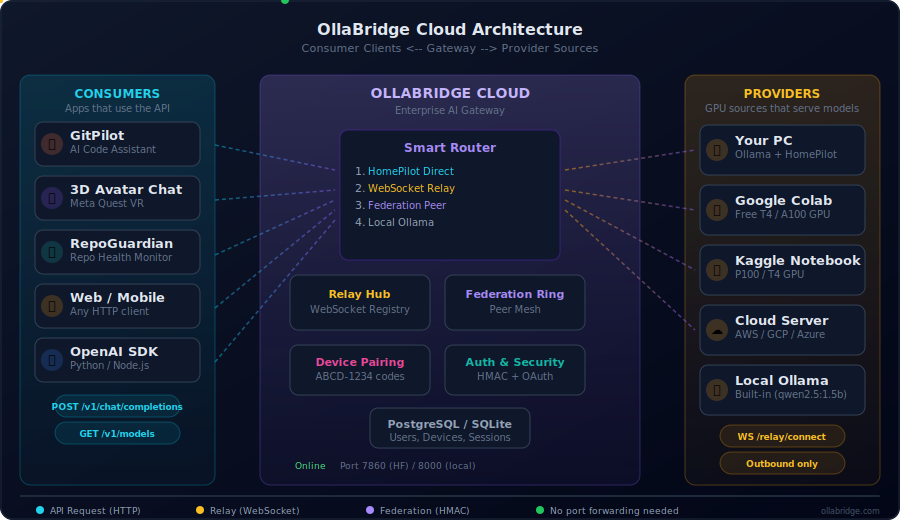
</p>

- **Gateway (control plane)** — FastAPI server exposing `/v1/*`, the dashboard, and admin APIs
- **Nodes (compute plane)** — Ollama/HomePilot/provider adapters that dial out over WebSockets
- **Cloud relay (optional)** — outbound-only WSS bridge so your devices are reachable from anywhere, tenant-isolated per account

Deep dives: [docs/ARCHITECTURE.md](docs/ARCHITECTURE.md) • [docs/SCALING.md](docs/SCALING.md) • [docs/THREAT_MODEL.md](docs/THREAT_MODEL.md)

---

## 🤖 AI-Agent Native

OllaBridge ships an **MCP server** so AI agents can manage your infrastructure — create enrollment tokens, list runtimes, check health — through the Model Context Protocol:

```bash
ollabridge-mcp        # stdio MCP server for Claude Desktop, IDEs, agents
```

See [docs/MCP.md](docs/MCP.md).

---

## 📚 Documentation

| Getting started | Operations | Security & Enterprise |
|---|---|---|
| [Quickstart](docs/QUICKSTART.md) | [CLI Reference](docs/CLI.md) | [Security Policy](docs/SECURITY.md) |
| [Tutorial](docs/TUTORIAL.md) | [API Reference](docs/API.md) | [Privacy](docs/PRIVACY.md) |
| [Examples (SDKs, LangChain, cURL)](docs/EXAMPLES.md) | [Configuration & Auth](docs/CONFIGURATION.md) | [Threat Model](docs/THREAT_MODEL.md) |
| [Install Guide](INSTALL.md) | [Scaling & Public Access](docs/SCALING.md) | [Deployment Hardening](docs/DEPLOYMENT_HARDENING.md) |
| | [Relay Verification](docs/RELAY_VERIFICATION.md) | [Enterprise Architecture & RBAC](docs/ENTERPRISE.md) |
| | [Cloud Sync](docs/CLOUD_SYNC.md) | [Provider Keys (BYOK)](docs/PROVIDER_KEYS.md) |
| | [Providers Hub](docs/PROVIDERS_HUB.md) | [Enterprise Readiness Audit](docs/AUDIT_ENTERPRISE_READINESS.md) |
| | [HomePilot Integration](docs/HOMEPILOT.md) | [Enterprise Roadmap](docs/ROADMAP_ENTERPRISE.md) |
| | [MCP / AI Agents](docs/MCP.md) | |
| | [Local Model Catalog](docs/LOCAL_CATALOG.md) | |

---

## 🗺️ Roadmap

- [x] Control plane + dial-out node architecture (no port forwarding)
- [x] Web dashboard (Broadcast Tower visualization)
- [x] Optional cloud pairing + relay with end-to-end verification (`doctor relay`, `doctor e2e`)
- [x] Explicit, metadata-only cloud sync with privacy-first defaults
- [x] BYOK provider hub with encrypted key storage, rotation, and redaction
- [x] Policy routing with explainable aliases (`route explain`)
- [x] Request tracing without prompt content
- [x] Multi-provider free-tier routing (score-based selection)
- [x] HomePilot persona integration • MCP server for AI agents
- [ ] 🚧 Cloud encrypted vault & organization vault APIs
- [ ] 🚧 Relay streaming (`delta`/`done` frames end to end)
- [ ] 🚧 Prometheus metrics • more runtimes (vLLM, llama.cpp, LM Studio)

Full phased plan with shipped/planned status: [docs/ROADMAP_ENTERPRISE.md](docs/ROADMAP_ENTERPRISE.md)

---

## 🤝 Contributing

We welcome contributions! Areas we'd love help with: runtime adapters (vLLM, llama.cpp), monitoring/metrics, security reviews, docs.

1. Fork the repo
2. Create a branch (`git checkout -b feature/amazing`)
3. Make your changes and add tests (`make install-dev && make test`)
4. Submit a PR

---

## 📄 License

Apache License 2.0 — see [LICENSE](LICENSE)

## 🙏 Built With

[FastAPI](https://fastapi.tiangolo.com/) • [Ollama](https://ollama.ai/) • [WebSockets](https://websockets.readthedocs.io/) • [SQLModel](https://sqlmodel.tiangolo.com/) • [React](https://react.dev/) + [Vite](https://vitejs.dev/)

## 💬 Support

📖 [Documentation](docs/) • 🐛 [Report a Bug](https://github.com/ruslanmv/ollabridge/issues) • 💡 [Request a Feature](https://github.com/ruslanmv/ollabridge/issues) • 💬 [Discussions](https://github.com/ruslanmv/ollabridge/discussions)

## 🌟 Star History

If OllaBridge helped you, give it a star! ⭐

---

## Compatible with HomePilot

<p align="center">
  <a href="https://github.com/ruslanmv/HomePilot">
    
  </a>
</p>

OllaBridge is the recommended gateway for [HomePilot](https://github.com/ruslanmv/HomePilot) personas. Route `persona:*` and `personality:*` models to HomePilot while serving local LLMs via Ollama — all through a single OpenAI-compatible endpoint. Setup: [docs/HOMEPILOT.md](docs/HOMEPILOT.md).

<p align="center">
  
</p>

Connect [3D Avatar Chatbot](https://github.com/ruslanmv/3D-Avatar-Chatbot) for an immersive VR persona experience with lip sync, gestures, and voice.

<p align="center">
  
</p>

---

<div align="center">

**Made with ❤️ for the local-first AI community**

**Stop paying cloud tokens. Use your own compute.**

</div>
