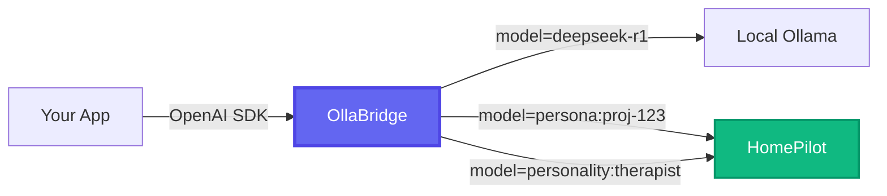

# HomePilot Integration

Route `persona:*` / `personality:*` models to a HomePilot instance alongside local
LLMs — one OpenAI-compatible endpoint for both.

---

## 🏠 HomePilot Integration

OllaBridge includes a built-in **HomePilot connector** that exposes [HomePilot](https://github.com/ruslanmv/HomePilot) personas as standard OpenAI models. Any app that speaks OpenAI — including [3D Avatar Chatbot](https://github.com/ruslanmv/3D-Avatar-Chatbot) — can chat with persistent AI personas that have personality, long-term memory, and MCP tool access.

### Enable HomePilot

```env
# .env
HOMEPILOT_ENABLED=true
HOMEPILOT_BASE_URL=http://localhost:8000
HOMEPILOT_API_KEY=your-api-key
```

### How It Works



**Smart routing**: Models starting with `persona:` or `personality:` are automatically sent to HomePilot. Everything else goes to Ollama or other connected nodes.

### Chat with a Persona

```python
from openai import OpenAI

client = OpenAI(
    base_url="http://localhost:11435/v1",
    api_key="sk-ollabridge-YOUR-KEY"
)

# Chat with a HomePilot persona — same OpenAI API
response = client.chat.completions.create(
    model="persona:my-therapist",
    messages=[{"role": "user", "content": "I've been feeling stressed."}]
)

print(response.choices[0].message.content)
```

### Discover Available Personas

```bash
# List all models (Ollama + HomePilot personas)
curl -H "Authorization: Bearer sk-ollabridge-..." \
  http://localhost:11435/v1/models
```

Returns both local Ollama models and HomePilot personas in a single list:

```json
{
  "data": [
    {"id": "deepseek-r1", "owned_by": "ollama"},
    {"id": "personality:therapist", "owned_by": "homepilot"},
    {"id": "persona:proj-abc123", "owned_by": "homepilot"}
  ]
}
```

### What Personas Bring

Each HomePilot persona includes capabilities beyond a plain LLM:

| Feature | Description |
|---|---|
| **Personality** | Rich system prompt with psychology, voice style, behavior |
| **Long-Term Memory** | Per-persona persistent memory across sessions |
| **MCP Tools** | Gmail, Calendar, GitHub, Slack, web search, and more |
| **Knowledge Base** | RAG over uploaded documents |
| **Image Generation** | ComfyUI workflows (FLUX, SDXL) |

All transparent to the client — you get a standard OpenAI-format response.

### 3D Avatar Chatbot + HomePilot

The [3D Avatar Chatbot](https://github.com/ruslanmv/3D-Avatar-Chatbot) has a built-in OllaBridge provider. Select it in Settings, fetch models, and your 3D avatar speaks with HomePilot persona personality and memory:

```
3D Avatar Chatbot → OllaBridge Gateway → HomePilot Persona → LLM + Memory + Tools
```

### Full Architecture

```
┌──────────────────────────────────────────┐
│           OllaBridge Gateway             │
│                                          │
│  Registry                                │
│  ├── local_ollama   → Ollama (:11434)    │
│  ├── relay_link     → Remote GPUs        │
│  └── homepilot      → HomePilot (:8000)  │
│                                          │
│  Router                                  │
│  ├── "persona:*"    → homepilot nodes    │
│  ├── "personality:*"→ homepilot nodes    │
│  └── other models   → best available     │
└──────────────────────────────────────────┘
```

For detailed persona system documentation, see [HomePilot's OLLABRIDGE.md](https://github.com/ruslanmv/HomePilot/blob/main/docs/OLLABRIDGE.md).

---

