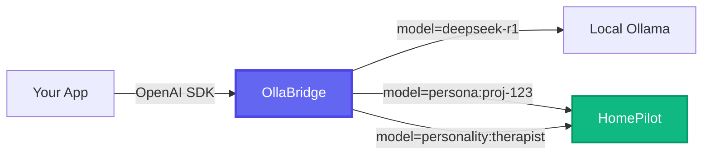

# HomePilot Integration

Route `persona:*` / `personality:*` models to a HomePilot instance alongside local
LLMs — one OpenAI-compatible endpoint for both.

---

## 🏠 HomePilot Integration

OllaBridge includes a built-in **HomePilot connector** that exposes [HomePilot](https://github.com/ruslanmv/HomePilot) personas as standard OpenAI models. Any app that speaks OpenAI — including [3D Avatar Chatbot](https://github.com/ruslanmv/3D-Avatar-Chatbot) — can chat with persistent AI personas that have personality, long-term memory, and MCP tool access.

### Enable HomePilot

```env
# .env
HOMEPILOT_ENABLED=true
HOMEPILOT_BASE_URL=http://localhost:8000
HOMEPILOT_API_KEY=your-api-key
```

### How It Works


```mermaid
graph LR
    A[Your App] -->|OpenAI SDK| B[OllaBridge]
    B -->|"model=deepseek-r1"| C[Local Ollama]
    B -->|"model=persona:proj-123"| D[HomePilot]
    B -->|"model=personality:therapist"| D

    style B fill:#6366f1,stroke:#4f46e5,stroke-width:3px,color:#fff
    style D fill:#10b981,stroke:#059669,stroke-width:2px,color:#fff
```

**Smart routing**: Models starting with `persona:` or `personality:` are automatically sent to HomePilot. Everything else goes to Ollama or other connected nodes.

### Chat with a Persona

```python
from openai import OpenAI

client = OpenAI(
    base_url="http://localhost:11435/v1",
    api_key="sk-ollabridge-YOUR-KEY"
)

# Chat with a HomePilot persona — same OpenAI API
response = client.chat.completions.create(
    model="persona:my-therapist",
    messages=[{"role": "user", "content": "I've been feeling stressed."}]
)

print(response.choices[0].message.content)
```

### Discover Available Personas

```bash
# List all models (Ollama + HomePilot personas)
curl -H "Authorization: Bearer sk-ollabridge-..." \
  http://localhost:11435/v1/models
```

Returns both local Ollama models and HomePilot personas in a single list:

```json
{
  "data": [
    {"id": "deepseek-r1", "owned_by": "ollama"},
    {"id": "personality:therapist", "owned_by": "homepilot"},
    {"id": "persona:proj-abc123", "owned_by": "homepilot"}
  ]
}
```

### What Personas Bring

Each HomePilot persona includes capabilities beyond a plain LLM:

| Feature | Description |
|---|---|
| **Personality** | Rich system prompt with psychology, voice style, behavior |
| **Long-Term Memory** | Per-persona persistent memory across sessions |
| **MCP Tools** | Gmail, Calendar, GitHub, Slack, web search, and more |
| **Knowledge Base** | RAG over uploaded documents |
| **Image Generation** | ComfyUI workflows (FLUX, SDXL) |

All transparent to the client — you get a standard OpenAI-format response.

### 3D Avatar Chatbot + HomePilot

The [3D Avatar Chatbot](https://github.com/ruslanmv/3D-Avatar-Chatbot) has a built-in OllaBridge provider. Select it in Settings, fetch models, and your 3D avatar speaks with HomePilot persona personality and memory:

```
3D Avatar Chatbot → OllaBridge Gateway → HomePilot Persona → LLM + Memory + Tools
```

### The avatar session relay

Chat gives the avatar a persona. The **session relay** gives it the rest: intents HomePilot
starts on its own, curiosity, screen-insight asks, and panels. That needs a socket, and a
browser cannot open one to HomePilot directly — an HTTPS page may not open `ws://localhost`,
and a hosted page's "localhost" is the server it came from, not the user's PC. So the socket
comes here instead:

```
browser ──wss──▶ OllaBridge /v1/avatar/session ──ws──▶ HomePilot /avatar/session
```

**Nothing to configure.** Enabling HomePilot under Local Runtimes is the whole setup. The
relay reads the same base URL and API key the connector uses; there is no second place to put
them.

**The browser never holds HomePilot's key.** It presents *OllaBridge's* credential — the
pairing token or API key it already has — and this proxy validates that with the same three
auth modes as every other route, then swaps in HomePilot's key before forwarding the hello.
One secret, one origin. It is also why the avatar needs no HomePilot token field: it has none,
and used to send an empty string that HomePilot's presence check refused.

The proxy reads exactly one frame — the hello, because that is where the token is. Everything
after it is pumped verbatim in both directions. Message types, version bumps and future fields
are HomePilot's business and the client's; an opinion here would be a second implementation of
one protocol, drifting.

### Feature detection

`GET /health` reports what this bridge can do:

```json
{
  "homepilot_enabled": true,
  "avatar": { "session": "/v1/avatar/session", "features": ["directives", "curiosity", "vision", "panels"] }
}
```

**Absence means no.** A bridge that omits the `avatar` block cannot relay the session, and
every OllaBridge released before this feature omits it. That is the entire version
negotiation — no handshake, no minimum version, no upgrade required to keep working. The
avatar reads the absence and falls back to the chat path, which already carries `x_directives`,
so the persona still drives gestures and media; what it loses is her speaking first.

The block is also absent when HomePilot is enabled but the relay could not actually run — for
instance if the `websockets` client library is missing. Advertising a relay that then refuses
every socket would turn a graceful degrade into a broken feature.

### Through the Cloud, when HomePilot is on your own machine

Local OllaBridge and HomePilot are on one machine, so the relay is a straight proxy. With
OllaBridge Cloud they are not: the browser reaches the Cloud, and the Cloud cannot reach your
HomePilot — that is the entire reason the relay link exists. The session goes the same way
inference already does, one hop further:

```
browser ──wss──▶ Cloud ──relay link──▶ your node ──ws──▶ HomePilot
```

**This needed a new frame, and it is worth saying why.** Inference over the relay is
request/response: the Cloud asks, the node answers, and nothing is ever said unprompted. An
avatar session is not shaped like that — HomePilot starts turns of its own (curiosity, a
greeting, a reaction to what is on screen), and a node with something to say had nowhere to put
it in a protocol where every frame answers a question the Cloud asked. So the hub gained a
mirror pair:

| Direction | Frame | Answered? |
|---|---|---|
| Cloud → node | `req` | yes, with `res` |
| Cloud → node | **`sig`** | no |
| node → Cloud | `res` | — |
| node → Cloud | **`ev`** | no |

`sig` is not a `req` with the response ignored: a `req` allocates a future something must
resolve, an unanswered one leaks until timeout, and a session sends thousands of frames. `ev`
is not a `res`, because it answers nothing.

Every `sig` and `ev` carries a **stream** id. One node may be relaying several browser sessions
at once, and an event must reach the one it belongs to — delivering to all of them would put one
person's conversation in front of another. A node may only push into streams it owns, and when a
node disconnects every stream on it is woken rather than left waiting: otherwise the browser
holds a socket whose far end is gone, showing a connected avatar that will never move again.

**Enabling it on the node.** Set `HOMEPILOT_BASE_URL` where the node agent runs. It then
advertises `avatar` in its hello, and the Cloud picks it for sessions. A node that does not
advertise it is never chosen, so "no HomePilot behind this bridge" stays an answer given in
advance rather than a socket that opens and then fails.

The node does not re-decide who may connect. The hello it forwards is the one the bridge already
authorised and rewrote; making that judgement twice would mean two answers to one question.

### Full Architecture

```
┌──────────────────────────────────────────┐
│           OllaBridge Gateway             │
│                                          │
│  Registry                                │
│  ├── local_ollama   → Ollama (:11434)    │
│  ├── relay_link     → Remote GPUs        │
│  └── homepilot      → HomePilot (:8000)  │
│                                          │
│  Router                                  │
│  ├── "persona:*"    → homepilot nodes    │
│  ├── "personality:*"→ homepilot nodes    │
│  └── other models   → best available     │
└──────────────────────────────────────────┘
```

For detailed persona system documentation, see [HomePilot's OLLABRIDGE.md](https://github.com/ruslanmv/HomePilot/blob/main/docs/OLLABRIDGE.md).

---

