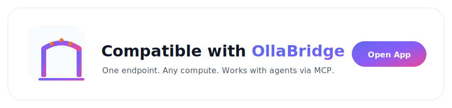

# OllaBridge Brand Assets (`logos/`)

This folder contains **vendor-neutral, reusable brand assets** for web apps, documentation,
marketing pages, and partner products that integrate with **OllaBridge**.

Use these assets to signal **“OllaBridge-compatible”** and link users directly to a running
OllaBridge instance.

---

## Primary Logo

Use this when you want to **represent OllaBridge itself** (landing pages, docs headers).

### SVG (recommended)


**File**
- `obridge-logo.svg`

**Use when**
- Product homepages
- Documentation headers
- Slides and presentations

---

## Compatibility Badge (Small)

Use this when your app **supports OllaBridge** and you want a subtle indicator.

### SVG (recommended)


**Files**
- `obridge-badge.svg`
- `obridge-badge@1x.png`
- `obridge-badge@2x.png`

**Use when**
- README files
- Settings pages
- Plugin / extension listings
- Marketplace pages

---

## Compatibility Banner — Light Background

Use this when you want a **strong visual call-to-action** on light UIs.



**Files**
- `obridge-banner.light.svg`
- `obridge-banner.light@1x.png`
- `obridge-banner.light@2x.png`

**Use when**
- Web app footers
- Marketing pages
- Docs landing pages

---

## Compatibility Banner — Dark Background

Use this version for **dark mode UIs** or dark marketing pages.


**Files**
- `obridge-banner.dark.svg`
- `obridge-banner.dark@1x.png`
- `obridge-banner.dark@2x.png`

**Use when**
- Dark dashboards
- Dark documentation themes
- Developer tools

---

## App Icons (PNG)

Use these for **favicons, launchers, or app listings**.

| Light | Dark |
|------|------|
|  |  |

**Files**
- `obridge-icon.light-128.png`
- `obridge-icon.light-512.png`
- `obridge-icon.dark-128.png`
- `obridge-icon.dark-512.png`

---

## Recommended Storage (GitHub Reuse)

**Best practice:** keep this folder in a standalone repo **or** a dedicated path in your monorepo.

Common patterns:

1. **Dedicated repo**
```
ollabridge/brand-assets
```

2. **Monorepo path**
```
assets/brand/logos/
```

### Reuse options
- Git **submodule**
- Git **subtree**
- GitHub **Release artifact** (`ollabridge-logos.zip`)
- Optional package: `ollabridge-assets`

---

## Usage Examples

### Web (HTML)

```html
<a href="https://YOUR-OBRIDGE-URL/" target="_blank" rel="noopener">
  
</a>
```

---

### Markdown (GitHub README)

```md
[](https://YOUR-OBRIDGE-URL/)
```

---

### React

```tsx
export function OBridgeBadge() {
  return (
    <a
      href="https://YOUR-OBRIDGE-URL/"
      target="_blank"
      rel="noreferrer"
    >
      
    </a>
  );
}
```

---

## Branding Guidelines (Quick)

* Prefer **SVG** whenever possible (sharp at all sizes)
* Use **light assets on light backgrounds**
* Use **dark assets on dark backgrounds**
* Keep clear space around logos (≥ height of the bridge base)
* ❌ Do not recolor gradients
* ❌ Do not stretch or skew assets

---

## License

If these assets are intended for third-party usage, add a license here
(e.g. **CC BY 4.0** or your commercial brand license).

© OllaBridge
